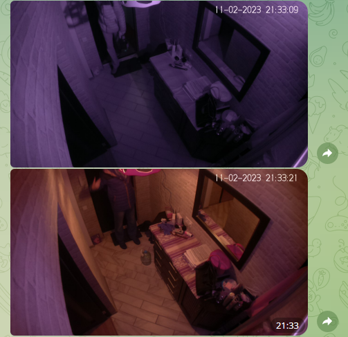
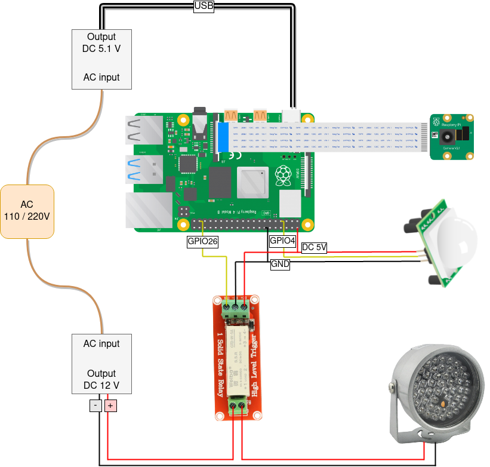
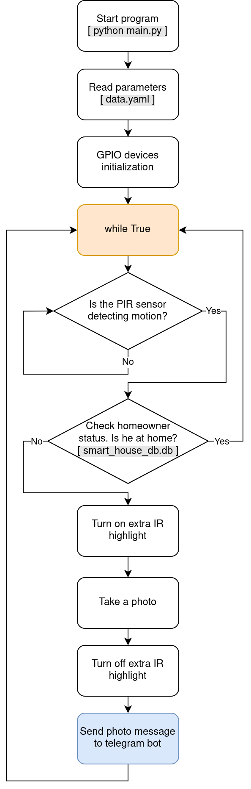

A small solution for motion registration. Based on Raspberry PI 4 and appropriate DIY components.

**Brief explanation:** When PIR sensor registers any motion, the script logic is checking the status of the owner (is he at home?), and then, if the owner is not at home, noIR camera takes a shot and send it to telegram. In case when the owner is at home, the camera doesn't take a shot, also PIR sensor pauses for 10 seconds.

Example of notification telegram message:



This solution is one part of the personal smart home idea that runs on the Raspberry PI board(s).

## Features

### Hardware

- [Raspberry Pi 4](https://www.raspberrypi.com/products/raspberry-pi-4-model-b/)
- [Camera noIR OV5647](https://www.arducam.com/product/arducam-ov5647-noir-m12x0-5-mount-camera-board-w-raspberry-pi/)
  - [IR CCTV illuminator YT-BF1](https://www.aliexpress.com/item/956035021.html?spm=a2g0o.order_list.order_list_main.263.17c418024XN11g)
- [PIR sensor HC-SR501](https://www.aliexpress.com/item/33059656157.html?spm=a2g0o.order_list.order_list_main.506.17c418024XN11g)
- [Solid State Relay Weiba GTD-5V-5A](https://www.aliexpress.com/item/4000074441199.html?gatewayAdapt=4itemAdapt)

### Scheme of connection



### Software

- GPIO manage via library - [gpiozero](https://gpiozero.readthedocs.io/en/stable/)
- Script configuration parameters in data.yaml
- Script works with Python 3.7 and higher
- Database for owner status [here](https://github.com/StasTODD/smart_house)

Main logic:



## Installation

- Clone or download project from github.

- Create and activate special venv for project:

  ```shell
  $ cd rpi_pirsensor_camera_telegram/
  $ python3.7 -m venv venv
  $ source venv/bin/activate
  ```

- Install required packets to the venv:

  ```shell
  (venv) $ pip install -U pip setuptools wheel
  (venv) $ pip install -r requirements.txt
  ```

- Start the script:

  ```shell
  (venv) $ python main.py
  ```

- Alternative variant of starting:

  ```shell
  $ ./main.py
  ```